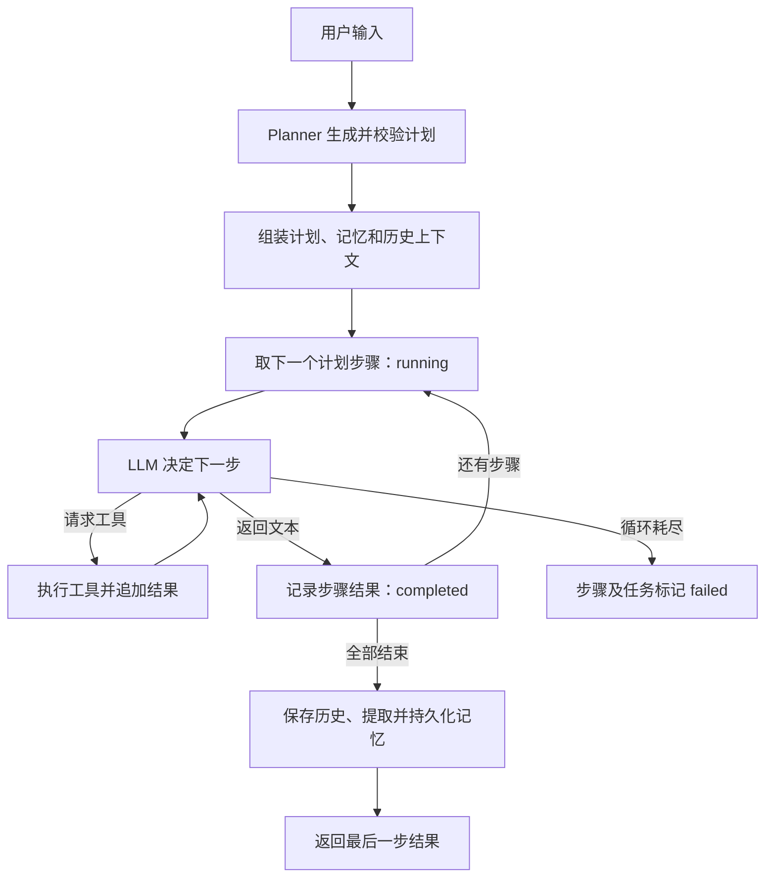

# MiniAgent

一个用于学习 Agent 工作原理的 Python 项目。从模型调用、工具执行开始，逐步实现上下文管理、SQLite 长期记忆、运行状态和按计划执行任务。

使用 OpenAI Python SDK 调用兼容 Chat Completions 的服务，用 Pydantic 描述计划与状态，没有依赖 Agent 编排框架。代码包含中文注释，适合边运行、边观察、边修改。

> 当前版本是学习用 MVP，已跑通多步骤任务的正常执行流程。天气工具返回固定测试数据，用于观察工具调用链，不提供实时天气。

## 已实现的能力

- **工具调用**：模型选择工具并生成参数，Python 执行工具，将结果送回模型。
- **Agent Loop**：持续进行模型与工具交互，直到得到文本结果或达到循环上限。
- **任务规划**：Planner 将用户输入拆成 JSON 计划，Pydantic 解析并校验结构。
- **顺序执行**：逐步执行计划，记录每步的状态和结果。
- **短期历史**：按完整回合保存历史，每次请求注入最近五轮。
- **长期记忆**：从本轮用户输入提取信息，保存到 SQLite，下次运行重新读取。
- **运行状态**：记录上下文、执行循环次数、工具轨迹、计划进度及最终答案。

## 快速开始

需要 Python 3.12 或以上版本，以及已安装的 `uv`。模型服务需要支持工具调用，并能按提示输出 JSON。

下载或克隆仓库后，在项目根目录执行：

```bash
uv sync
cp .env.example .env
```

编辑 `.env`，填入自己的配置：

```dotenv
API_KEY=your-api-key
BASE_URL=https://your-provider.example/v1
MODEL_NAME=your-model-name
```

| 配置 | 用途 |
| --- | --- |
| `API_KEY` | 模型服务的 API Key |
| `BASE_URL` | 服务提供的 OpenAI 兼容 API 基础地址，不是完整对话接口路径 |
| `MODEL_NAME` | 服务支持的模型名称或接入点标识 |

这些变量名是本项目约定，请使用 `API_KEY`，而非只设置 `OPENAI_API_KEY`。

当前 `llm.py` 还发送 `reasoning_effort="high"` 和 `extra_body={"thinking": {"type": "enabled"}}`。不同服务对这些参数的支持不同；若返回“不支持参数”等错误，先查看响应，再根据所用服务的接口约定调整这两项。兼容 Chat Completions 并不意味着支持这些扩展参数。

启动交互：

```bash
uv run main.py
```

示例输入：

```text
请输入你想要问的问题：查询北京和上海的天气，然后比较哪个更适合出行。
```

程序先打印最终回答，再打印 `agent.state.model_dump()`，便于观察完整执行过程。输入 `exit` 退出。运行会调用配置的模型服务，可能产生 API 费用。

## 一次任务如何执行



以“查询北京和上海天气并比较”为例，计划可能有三步：查询北京、查询上海、比较两地。前两步各请求模型两次（请求工具、读取结果后回答），第三步直接比较，因此执行循环累计调用模型五次。计划内容和实际次数由模型输出决定。

此外，规划和记忆提取各有一次独立调用，不计入 `current_step`。本例通常共发起七次业务层模型请求，不包含 SDK 内部可能发生的重试。

## 代码结构与阅读顺序

| 文件 | 职责 |
| --- | --- |
| `main.py` | 命令行交互入口，复用同一个 Agent 实例 |
| `agent.py` | 组装上下文、协调规划与执行、保存历史和记忆 |
| `llm.py` | 模型服务边界，封装一次 Chat Completions 请求 |
| `tools.py` | 工具函数、名称到函数的注册表，以及模型可阅读的 schema |
| `state.py` | `ToolResult`、`PlanState`、`Plan`、`AgentState` 数据模型 |
| `planner.py` | 生成计划，用 `Plan.model_validate_json()` 解析模型输出 |
| `memory.py` | 从用户输入中提取长期信息，不直接操作数据库 |
| `memory_store.py` | SQLite 建表、键值更新与读取 |

建议从 `main.py → Agent.run()` 开始，再读 `execute_plan() → execute_agent_loop()`，最后查看工具、状态和记忆实现。

`execute_plan()` 控制步骤顺序和状态；`execute_agent_loop()` 负责一个步骤所需的模型与工具交互。模型返回文本只表示这次循环结束，当前代码没有额外校验任务是否真的完成。

## Context、History、Memory 与 State

| 数据 | 内容与生命周期 |
| --- | --- |
| `messages` | 本次执行的请求上下文；与 `state.messages` 指向同一个列表 |
| `self.history` | 当前进程的对话历史；只向模型发送最近五轮，但列表本身仍会增长 |
| `memory.db` | SQLite 长期记忆，重启程序后仍保留 |
| `agent.state` | 最近一次已挂到 Agent 上的运行状态；不持久化，后续运行会替换引用 |

每次 `run()` 创建新的 State，重新组装系统提示、计划、长期记忆、最近历史和用户输入。执行过程中追加步骤指令、模型消息及工具结果。

计划、记忆提示和步骤指令不写入 `history`；本轮模型消息与工具结果会写入。下次请求会重新加载最新记忆和新计划，避免把旧提示再次追加到历史。

注入上下文的计划文本是生成时的静态快照。更新 `state.plan.steps` 不会自动修改这段字符串，因此初始计划提示中的 `pending` 和最终状态中的 `completed` 可以同时存在。

几个容易混淆的字段：

- `current_step`：所有步骤的执行循环累计请求 LLM 的次数，不统计 Planner 和记忆提取。
- `current_plan_step_id`：当前执行的步骤编号；正常结束后为 `None`，执行循环失败时保留失败步骤编号。
- `tool_results`：工具名称、参数与原始返回文本。
- `plan.steps[*].result`：模型生成的步骤级结果。
- `final_answer`：最后一步的结果或失败提示；当前没有独立的最终汇总环节。

`max_steps = 10` 限制的是**每个步骤中的一次 Agent Loop**，不是整个任务总调用次数。

## 长期记忆如何保存

记忆提取器只读取本轮用户消息，期望模型返回这样的 JSON：

```json
{"姓名": "张三", "职业": "Python 开发者"}
```

SQLite 表中的 `key` 唯一。相同 key 使用 `ON CONFLICT` 更新 value；不同写法的 key 不会自动合并，例如“职业”和“工作”仍可能成为两条记录。

输入“我叫张三，是 Python 开发者，请记住”，退出程序后重新启动，再问自己的名字，可以观察持久化效果。数据库路径相对于启动目录，所以建议始终从项目根目录运行。

`MemoryManager.add()` 和 `get_all()` 是保留的早期内存示例，当前持久化链路使用 `extract()` 与 `MemoryStore`。

## 添加自己的工具

1. 在 `Tools` 中新增一个 Python 方法。
2. 将工具名和绑定方法加入 `registry`。
3. 在 `get_tools_schema()` 中描述同名函数及其参数。
4. 输入需要该工具的任务，检查 `tool_results` 和对应的 `tool_call_id`。

工具名称、schema 参数名和 Python 方法参数必须一致。schema 只是给模型的说明书，真正执行工具的是 `registry[name](**arguments)`。

## 当前限制与后续练习

- 天气数据是测试桩；固定日期及来源文字也只是测试文案。
- Planner 只接收本轮输入，不接收历史、长期记忆或工具能力清单。
- 计划未强制非空、步骤编号未校验唯一；Pydantic 默认会忽略额外字段，字段名必须与提示词一致。
- 工具异常会转成文本交给模型；返回文本不等于业务成功，失败尚未可靠传播到计划状态。
- 参数 JSON 解析、模型请求、记忆提取及数据库异常仍可能直接抛出，没有统一错误处理。
- 失败提示较粗略：空计划或模型返回 `None` 也可能显示执行超限。
- 最后一步结果直接作为最终回答，不保证每份计划的最后一步都覆盖完整用户目标。
- 历史只按轮数限制注入，没有 token 预算、历史摘要或语义记忆检索。
- State 不支持中断恢复；项目目前没有自动化测试套件，也没有并发任务隔离。

后续可依次练习：结构化执行结果、错误传播、计划校验、最终汇总，以及成功和失败路径的测试。

## 本地检查与发布

无需调用模型的语法检查：

```bash
uv run python -m py_compile main.py agent.py llm.py tools.py state.py planner.py memory.py memory_store.py
git diff --check
```

发布前查看 `git status` 和暂存差异。`.env`、`memory.db` 及其 SQLite 辅助文件已列入忽略规则；提交配置模板 `.env.example` 即可。忽略规则不会自动移除以前已跟踪的文件。

调试输出包含用户记忆、对话和工具数据。分享运行示例时请使用测试内容，避免直接粘贴个人对话或凭证。
